## sqlalchemy 同步/异步压力测试

>接口调用200次

### 1. 同步

+ `Sqlite`

  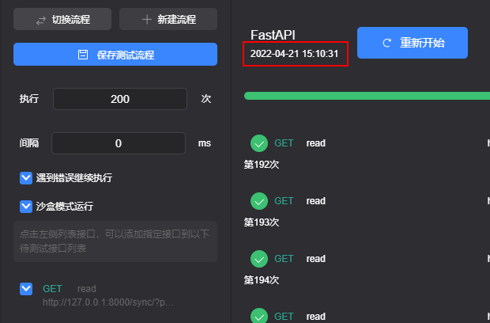

  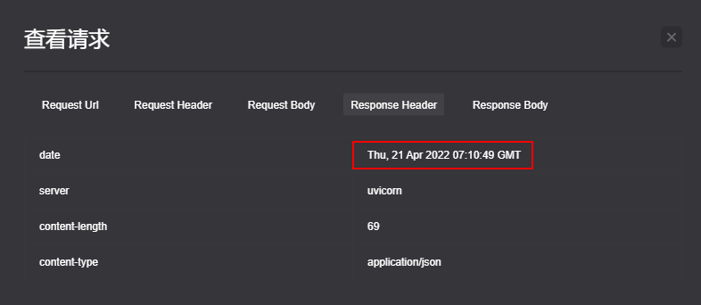

  ><font color="red">耗时 `18` s</font>

+ `Mysql`

  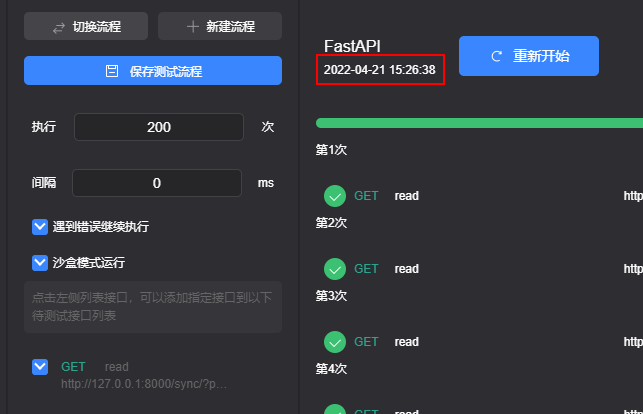

  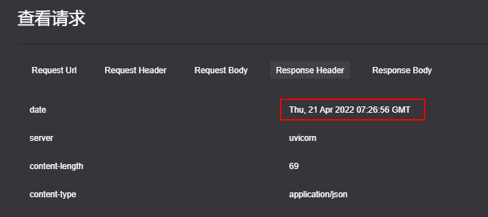

  ><font color="red">耗时 `18` s</font>

+ `Postgresql`

### 2.  异步

+ `Sqlite`

  

  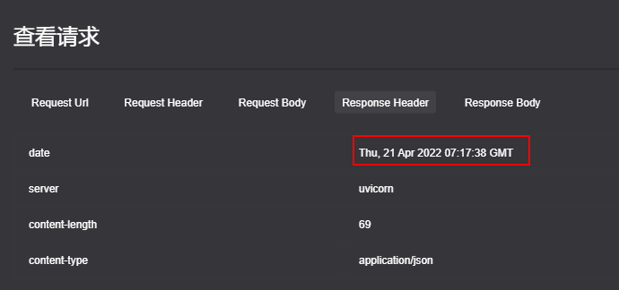

  ><font color="red">耗时近 `18` s</font>

+ `Mysql`

  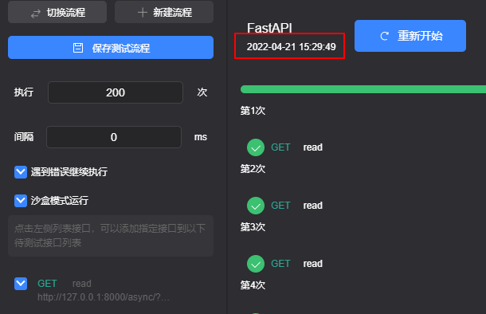

  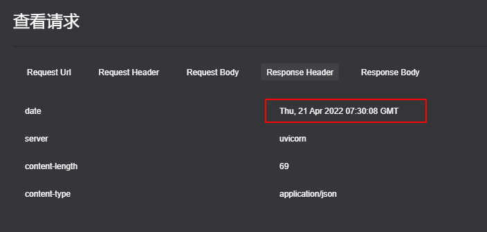

  ><font color="red">耗时近 `18` s</font>

+ `Postgresql`

  ><font color="red">耗时近 `18` s</font>

想不明白为什么耗时都是一样。。。！！！！


## FastAPI 并发压力测试(同步/异步)

```python
@app.get("/")
async def root():
    return {"message": "Hello World"}
```

### 1. 同步

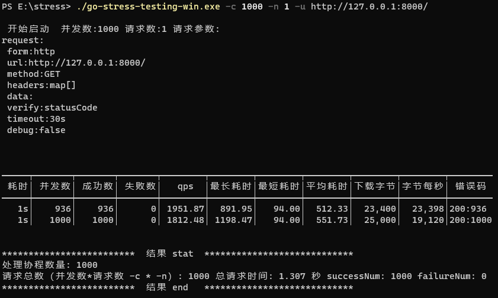

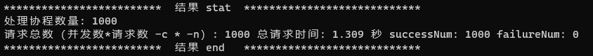


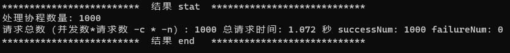

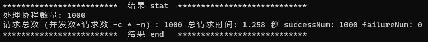

### 2. 异步

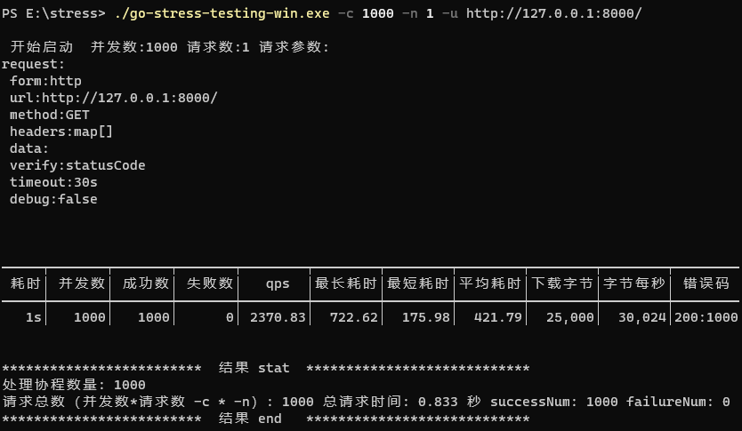

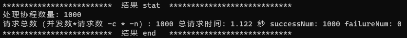

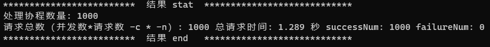


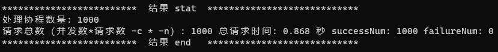