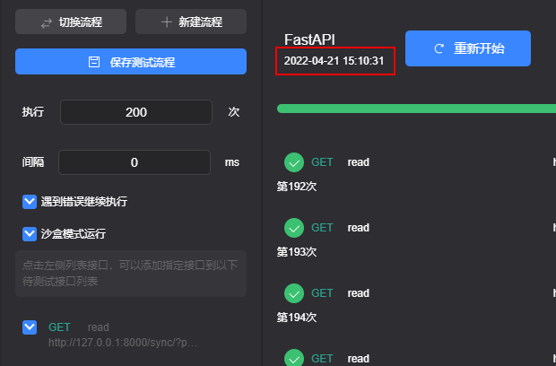
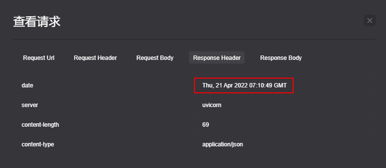
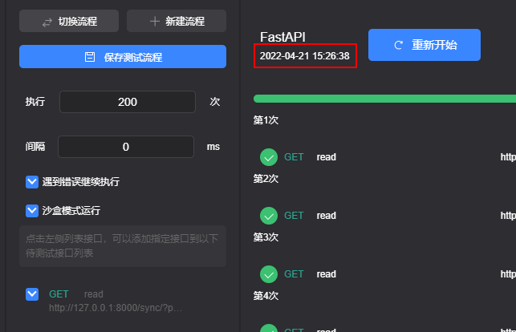
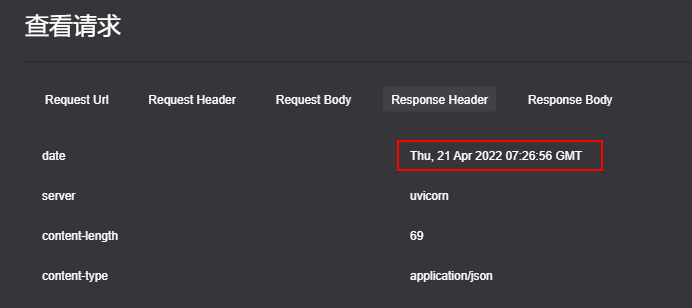
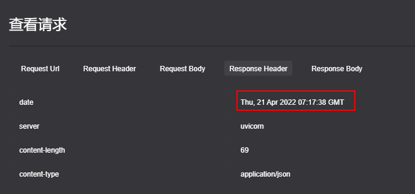
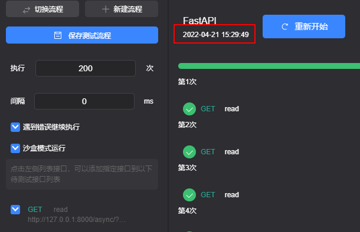
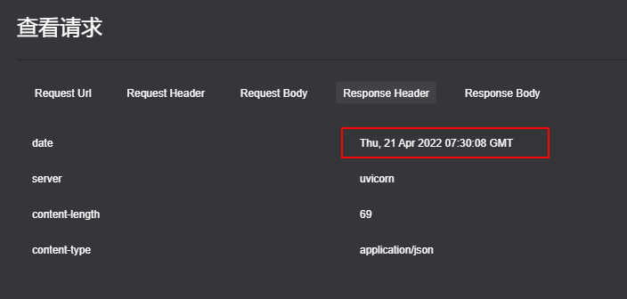

## sqlalchemy 同步/异步压力测试

>接口调用200次

### 1. 同步

+ `Sqlite`

  

  

  >耗时 `18` s

+ `Mysql`

  

  

  >耗时 `18` s

+ `Postgresql`

### 2.  异步

+ `Sqlite`

  

  

  >耗时近 `18` s

+ `Mysql`

  

  

  >耗时近 `18` s

+ `Postgresql`

  >出错。。

想不明白为什么耗时都是一样。。。！！！！